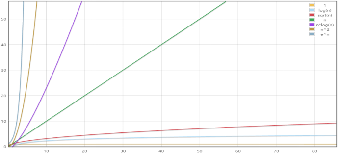
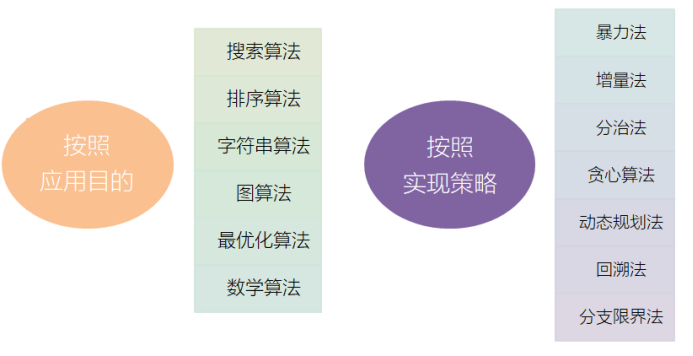

算法与数据结构解析课程大纲
#第一章 课程简介及算法复杂度分析
数据结构与算法概述
算法（Algorithm），就是“计算方法”，指解决一个问题具体的步骤和方法。
对于计算机而言，就是一系列解决问题的清晰指令。也就是说，对于一个问题，我们可以通过算法来描述解决的策略和步骤；对于规范的输入，按照算法描述的步骤，就可以在有限时间内得到对应的输出。

算法复杂度的概念

算法分类

常见经典算法
在实际应用中，有一些经典算法和策略，都可以作为解决问题的思路：
二分查找
快速排序、归并排序
KMP算法
快慢指针（双指针法）
普利姆（Prim）和 克鲁斯卡尔（Kruskal）算法
迪克斯特拉（Dijkstra）算法
其它优化算法：模拟退火、蚁群、遗传算法
#第二章 数组问题讲解
题目：两数之和
题目：三数之和
题目：下一个排列
题目：旋转图像
#第三章 二分查找相关问题讲解
程序员任何时候都必须能够手写的二分查找，还有很多常见变种。
二分查找理论讲解
二分查找代码实现
复杂度分析
力扣真题讲解
题目：搜索二维矩阵
题目：寻找重复数
#第四章 字符串问题讲解
题目：字符串相加
题目：字符串相乘
题目：去除重复字母
#第五章 滑动窗口相关问题讲解
TCP/IP中的握手机制的实现就用到了滑动窗口。一般结合数组或者字符串数据结构使用。
力扣真题讲解
题目：滑动窗口最大值
题目：最小覆盖子串
题目：找到字符串中所有字母异位词
#第六章 链表问题讲解
链表数据结构非常常见，比如操作系统的内存分配的原理。
链表数据结构复习
单向链表
双向链表
循环链表
力扣真题讲解
题目：反转链表
题目：合并两个有序链表
题目：删除链表的倒数第N个节点
#第七章 哈希表相关题目讲解
无处不在的哈希表，最经典的例子：JSON数据结构。
哈希表数据结构复习
哈希表代码Java实现
哈希表时间与空间复杂度分析
力扣真题讲解
题目：只出现一次的数字
题目：最长连续序列
题目：LRU缓存机制
#第八章 栈和队列问题讲解
栈和队列在计算机科学中也是无处不在的，如函数调用栈、优先队列等等。
栈和队列数据结构复习复习
栈的Java代码实现
队列的Java代码实现
优先队列数据结构复习
双向队列（双端队列）数据结构复习
复杂度分析
力扣真题讲解
题目：使用栈实现队列
题目：有效的括号
题目：柱状图中最大的矩形
#第九章 排序相关问题讲解
作为程序员必须掌握的排序算法：冒泡排序，插入排序，快速排序，归并排序，堆排序，桶排序。
排序相关算法复习
插入排序
冒泡排序
快速排序
归并排序
堆排序
桶排序
力扣真题讲解
题目：数组中的第K个最大元素
题目：颜色分类
题目：合并区间
#第十章 二叉树和递归问题讲解
作为一个程序员，必须掌握递归思想，而二叉树是理解递归最好的途径。而且，树形结构在计算机中也是随处可见，比如DOM树、目录树等。
树形数据结构分析
二叉树
二叉搜索树
B树、B+树
AVL树和红黑树
复杂度分析
力扣真题讲解
题目：翻转二叉树
题目：平衡二叉树
题目：验证二叉搜索树
#第十一章 贪心算法讲解
贪心算法理论讲解
贪心算法原理
以哈夫曼编码为例子讲解贪心算法
背包问题简介
力扣真题讲解
题目：跳跃游戏
题目：跳跃游戏II
题目：任务调度器
#第十二章 动态规划讲解
很多同学会觉得“动态规划”很难，我们在本课程中，将会彻底理解动态规划。
动态规划理论讲解
动态规划原理
动态规划的步骤
斐波那契数列
背包问题讲解
力扣真题讲解
题目：最长公共子序列
题目：不同的二叉搜索树
题目：买卖股票的最佳时机
题目：爬楼梯
题目：打家劫舍
题目：零钱兑换
#第十三章 回溯算法讲解
回溯算法在面试一些大厂时，是很常见的题目。著名的“八皇后”问题就是回溯算法的最著名的例子。
回溯算法讲解
以八皇后为例讲解
力扣真题讲解
题目：全排列
题目：括号生成
题目：电话号码的字母组合
#第十四章 深度优先搜索和广度优先搜索讲解
DFS、BFS在面试一些大厂时，也是很常见的题目。对于数结构的遍历，DFS和BFS是最常用的做法。
DFS、BFS讲解
DFS和BFS时间复杂度和空间复杂度分析
递归实现讲解
非递归实现讲解
力扣真题讲解
题目：单词搜索
题目：二叉树的序列化与反序列化
题目：课程表
#第十五章 位运算和数学方法讲解
位运算基础知识讲解
计算机底层的二进制表示
位运算符讲解
进制转换讲解
位运算实现海量数据去重
力扣真题讲解
题目：2的幂
题目：汉明距离
题目：可怜的小猪
题目：鸡蛋掉落
