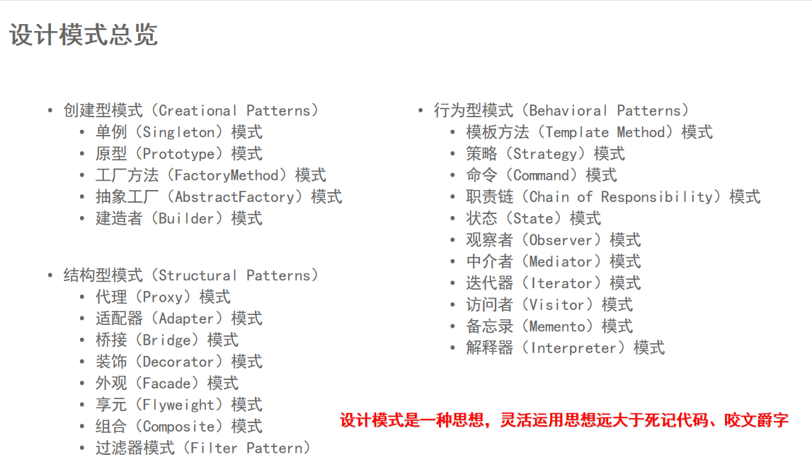
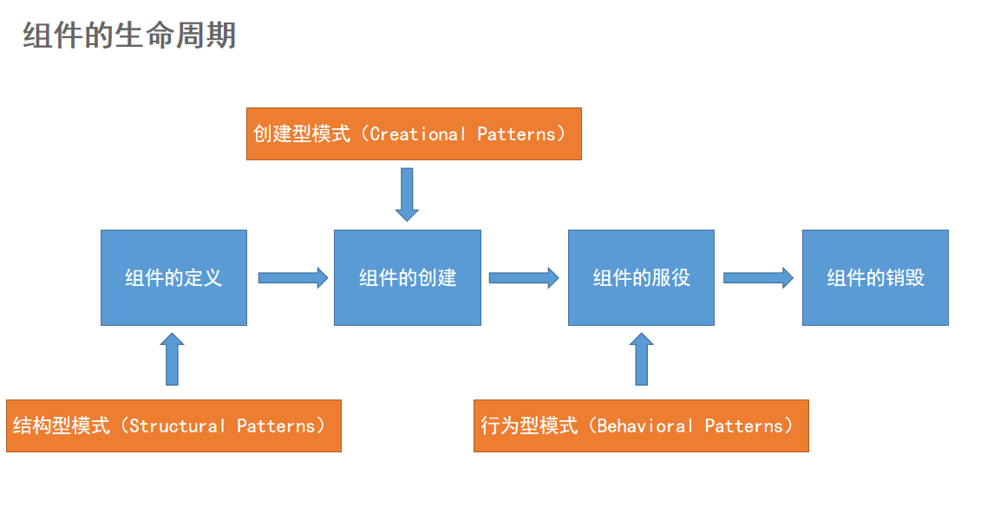

设计模式

设计的7大原则
###开闭原则（Open Closed Principle，OCP）
软件实体应当对扩展开放，对修改关闭（Software entities should be open for extension，but closed for modification）
合成复用原则、里氏替换原则相辅相成，都是开闭原则的具体实现规范
######扩展新类而不是修改旧类

###里氏替换原则（Liskov Substitution Principle，LSP）
继承必须确保超类所拥有的性质在子类中仍然成立（Inheritance should ensure that any property proved about supertype objects also holds for subtype objects）
######继承父类而不去改变父类

###依赖倒置原则（Dependence Inversion Principle，DIP）
高层模块不应该依赖低层模块，两者都应该依赖其抽象；抽象不应该依赖细节，细节应该依赖抽象（High level modules shouldnot depend upon low level modules.Both should depend upon abstractions.Abstractions should not depend upon details. Details should depend upon abstractions）
######面向接口编程，而不是面向实现类
###单一职责原则（Single Responsibility Principle，SRP）
一个类应该有且仅有一个引起它变化的原因，否则类应该被拆分（There should never be more than one reason for a class to change）
######每个类只负责自己的事情，而不是变成万能
###接口隔离原则（Interface Segregation Principle，ISP）
一个类对另一个类的依赖应该建立在最小的接口上（The dependency of one class to another one should depend on the smallest possible interface）。
######各个类建立自己的专用接口，而不是建立万能接口
###迪米特法则（Law of Demeter，LoD）
最少知识原则（Least Knowledge Principle，LKP)
只与你的直接朋友交谈，不跟“陌生人”说话（Talk only to your immediate friends and not to strangers）
######无需直接交互的两个类，如果需要交互，使用中间者
#####过度使用迪米特法则会使系统产生大量的中介类，从而增加系统的复杂性，使模块之间的通信效率降低
###合成复用原则（Composite Reuse Principle，CRP）
又叫组合/聚合复用原则（Composition/Aggregate Reuse Principle，CARP）
软件复用时，要尽量先使用组合或者聚合等关联关系来实现，其次才考虑使用继承关系来实现
######优先组合，其次继承

